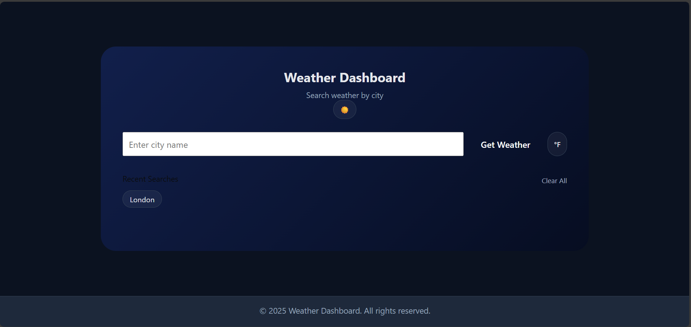
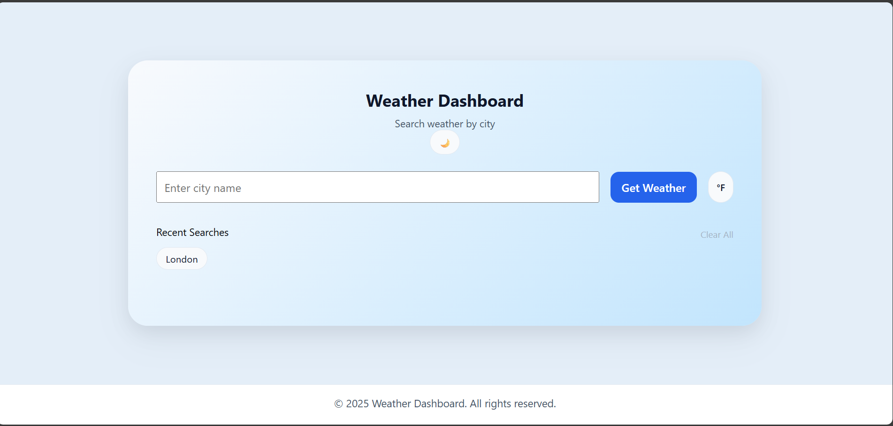
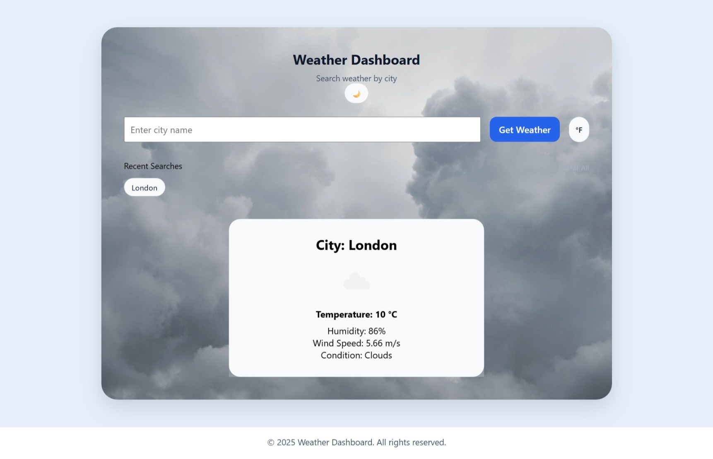
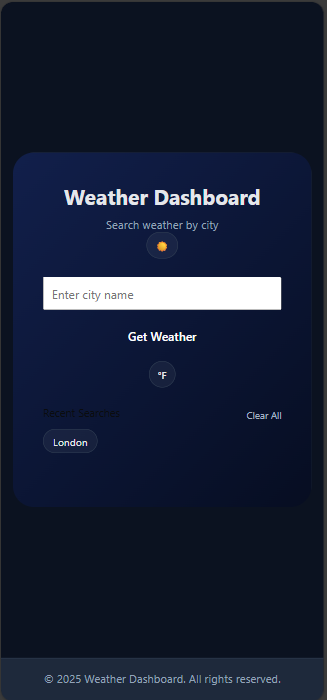

# 🌤 Weather Dashboard

A polished, responsive weather dashboard built with vanilla JavaScript that focuses on clean UI architecture, state management, and theme-based design systems.

This is my first frontend project and foundation piece for my developer portfolio.

## Live Demo
Live Site: https://weatherdashboardcodelynn.vercel.app/

Repository: https://github.com/Abilynn/weather-dashboard.git

## Preview

## Features
### Core Functionality
Search weather by city name
		
Real-time data from OpenWeather API
		
Temperature display with condition description
		
Weather-based dynamic background images

### UI / UX

Dark & Light theme toggle

Premium gradient fallback backgrounds

Dynamic weather image switching

Glassmorphism weather card with blur

Loading spinner during API requests

Error handling UI for invalid cities

Clean responsive mobile layout

### State & Persistence

Recent searches list

Persistent storage via localStorage

Temperature unit toggle (°C / °F)

Proper background reset on state change

## Technical Highlights

Built entirely with HTML, CSS, and Vanilla JavaScript

No frameworks or UI libraries

CSS Custom Properties (theme architecture)

Theme-based gradient system

Class-based background state switching

DOM state control through controlled class resets

Clean separation of UI logic and state logic

Branching & merging workflow practiced via Git

## Tech Stack

HTML5

CSS3 (Flexbox, gradients, backdrop-filter, custom properties)

JavaScript (ES6+)

OpenWeather API

Git & GitHub

## Architecture Decisions
### Theme System
Light and Dark modes are controlled via:

	body.classList.toggle("light")
Theme colors are defined using CSS variables, allowing consistent styling without duplicating components.

### Background Handling
Weather backgrounds are applied through dynamic class switching:

	app_container.className = "app_container";
	app_container.classList.add("bg-clear");
Default gradients are applied when no weather state exists.

### State Reset Strategy

To prevent background stacking issues:

	app_container.className = "app_container";
This ensures predictable UI state transitions.

## Responsiveness
### The layout adapts for:

Desktop

Tablet

Mobile

### Mobile polish includes:

Improved spacing

Button visibility fixes

Adjusted blur levels

Scaled typography

## What I Practiced in This Project

Writing meaningful pull requests (including solo PR workflow)

Branch creation & merging discipline

CSS layering & background architecture

Debugging theme conflicts

Improving UI contrast & visual hierarchy

Thinking in UI states instead of static pages

## Future Improvements

5-day forecast cards

Hourly forecast view

Geolocation support

Smooth background transitions

Unit preference persistence

Accessibility improvements (ARIA, contrast refinement)

